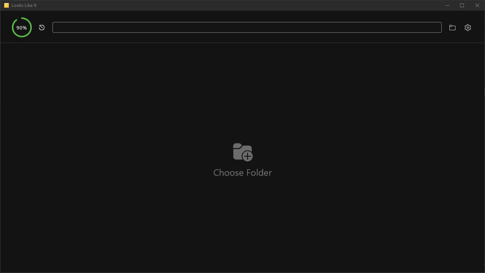
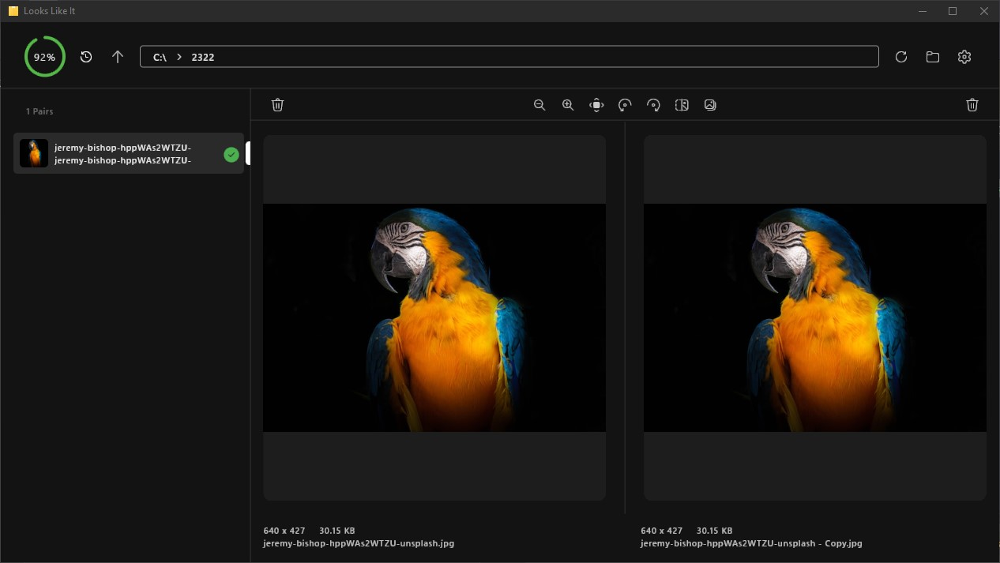
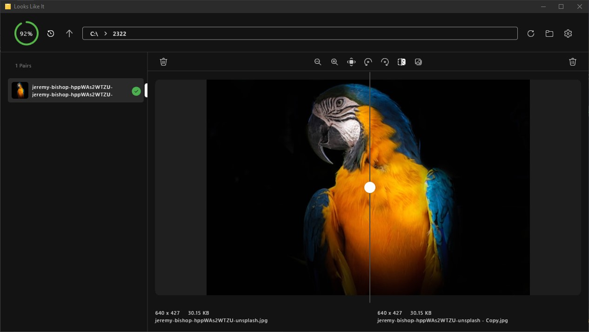
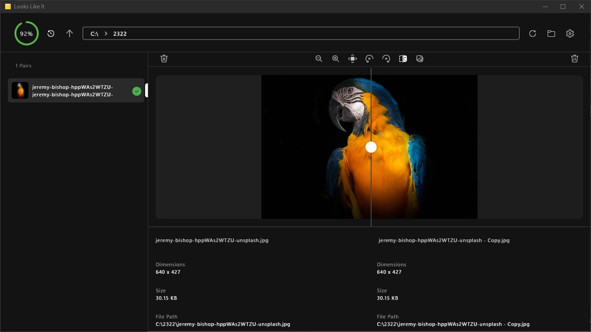

# Looks Like It

## Table of Contents

- [About](#about)
- [Screenshots](#screenshots)
- [Getting Started](#getting_started)
- [Usage](#usage)
- [Contributing](#contributing)
- [License](#license)

## About <a name = "about"></a>

Looks Like It is an application for comparing images using various image hashing algorithms. It provides an intuitive interface for identifying similar images within a folder.

## Screenshots <a name = "screenshots"></a>

|  |  |
| ----------------------------------- | ----------------------------------- | 
|  |  |

## Getting Started <a name = "getting_started"></a>

To get a local copy of the project up and running on your machine, follow these steps:

### Prerequisites

1. Install [Flutter](https://flutter.dev/docs/get-started/install)

### Installing

1. Clone the repository
```sh
git clone https://github.com/blackmonk13/looks_like_it.git
```
2. Navigate to the project directory
```sh
cd looks_like_it
```
3. Get the required packages
```sh
flutter pub get
```
4. Run the app on an Android emulator or device
```sh
flutter run
```

## Usage <a name = "usage"></a>

1. Launch the application.
2. Use the button in the top-left corner to set the desired similarity threshold.
3. Click on the "Choose Folder" button in the center of the screen to select a folder containing images you want to compare.
4. The app will index all images in the selected folder and identify similar images based on the set threshold.
5. View the results, which show similar images side by side.
6. Use the tools in the top bar of the results screen to interact with the found similarities (e.g., zoom, rotate, or delete).

## Contributing <a name = "contributing"></a>

Contributions are welcome! Please feel free to submit a Pull Request.

## License <a name = "license"></a>

This project is licensed under the MIT License - see the [LICENSE](LICENSE) file for details.